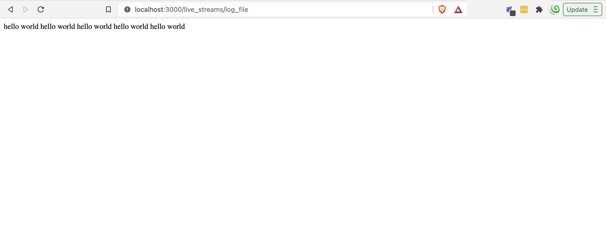
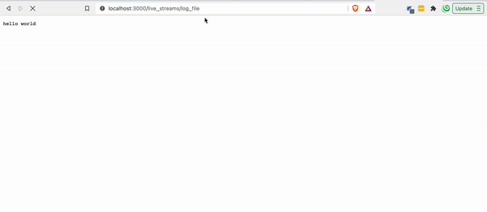
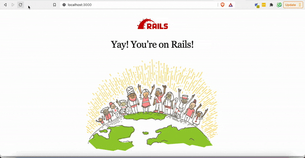
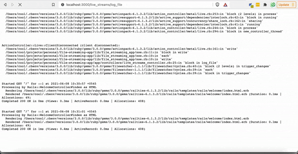

Live streaming log files have fascinated me for a long time now. I saw the use of live streaming log when I deployed an app in <a href="https://www.netlify.com/" target="_blank" rel="noopener">Netlify</a> for the first time. While deploying, Netlify displays the server log right in the browser so that as a user, we know what's happening in the background.

If you are confused on what I am talking about right now, you can also replicate that behavior if you open the log file with the command `tail -f` prepended to the file name like this: `tail -f log/development.log`

Now if you fire the rails server and access any route, that changes will be appended to the file and shown in the bash where we have opened `log/development.log`.

## Backstory

In one of the projects I am working on, we have invoicing module and we can create invoices with one click from the browser. Invoicing can take a long time to complete and user will have to wait there without knowing what's going in the background. That was when I began to wonder, what if we also try same thing like Netlify and show the logs to user as it happens in our Rails app server, that will be so cool.

Then I began my research and found this gem of a <a href="https://tenderlovemaking.com/2012/07/30/is-it-live.html" target="_blank" rel="noopener">tutorial</a> from <a href="https://twitter.com/tenderlove" target="_blank" rel="noopener">Aaron Patterson</a> himself. 

It was a 9 years old tutorial but had what we needed to start with. He streams some static code and not the actual file content but that was the start to know more about streaming in Rails. After a day of more research and trial and error, I got the live streaming for the log file to the browser from Rails app working.

## Implementation

Let's see step by step how I implemented live log streaming in the browser from Rails App.

### Step 1: Create a new Rails app

`rails new file-streaming-app`

### Step 2: Generate a controller for streaming files manually

`touch live_file_streams_controller.rb`

Add the following code inside

```ruby
class LiveFileStreamsController < ApplicationController
end
```

We are not using rails generator because it also generates view and helpers; which we don't need in this tutorial.

### Step 3: Add route for rendering the view

```ruby
resources :live_streams, only: [] do
  collection do
   get :log_file
  end
end
```

### Step 4: Stream with "response.stream"

To enable streaming in our Rails app, we will be using `response.stream` from `ActionController::Streaming`.

```ruby
class LiveStreamsController < ApplicationController
  def log_file
    5.times {
      response.stream.write "hello world\n"

      sleep 0.2
    }

    response.stream.close
  end
end
```

Read more about response streaming in <a href="https://api.rubyonrails.org/classes/ActionController/Streaming.html" target="_blank" rel="noopener">official Rails documentation</a>.

### Step 5: View response in browser

- Fire rails server `rails s`
- Go to `localhost:3000/live_streams/log_file`
- You will see "hello world" printed 5 times in the browser
- Response is printed at the same time, even though we used sleep function in between `response.write`



Let's print them one by one next.

### Step 6: Include `ActionController::Live` for live streaming response

```ruby
class LiveStreamsController < ApplicationController
  include ActionController::Live

  def log_file
    5.times {
      response.stream.write "hello world\n"

      sleep 0.2
    }

    response.stream.close
  end
end
```

`ActionController::Live` adds streaming functionality to all actions inside the controller. 

### Step 7: Response stays the same. What happened?

There is a bug inside the rack gem which is sending response at once instead of live streaming. You can find the issue discussion <a href="https://github.com/rack/rack/issues/1619" target="_blank" rel="noopener">here</a>.

As suggested in one of the <a href="https://github.com/rack/rack/issues/1619#issuecomment-848460528" target="_blank" rel="noopener">comments</a> in the discussion, let's add "Last-Modified" in `response.headers` with current time.

Let's also add "Content-Type" to `response.headers` with "text/event-stream" so that our response are actually streamed and displayed one by one.

```ruby
def log_file
  response.headers['Content-Type'] = 'text/event-stream'

  # hack due to new version of rack not supporting sse and sending all response at once: https://github.com/rack/rack/issues/1619#issuecomment-848460528
  response.headers['Last-Modified'] = Time.now.httpdate

  5.times {
    response.stream.write "hello world\n"

    sleep 0.2
  }

  response.stream.close
end
```

You should be able to see "hello world" printed one by one like below:



Wow! We live streamed something!

### Step 8: Server side events

From Aaron's blog:

> If you’ve never heard of Server-Sent Events (from here on we will be calling them SSEs), it’s a feature of HTML5 that allows long polling, but is built in to the browser. Basically, the browser keeps a connection open to the server, and fires an event in JavaScript every time the server sends data.

You can read further about it <a href="https://www.html5rocks.com/en/tutorials/eventsource/basics/" target="_blank" rel="noopener">here</a>

### Step 9: Create `file_streaming_app/sse.rb`

To emit events and format the response instead of inside controller, we will be creating a new class called `file_streaming_app/sse` inside `lib` folder.

Create the file with: `touch lib/file_streaming_app/sse.rb`

Add following to it:

```ruby
require 'json'

module FileStreamingApp
  class SSE
    def initialize(io)
      @io = io
    end

    def write(object)
      @io.write "#{JSON.dump(object)}"
    end

    def close
      @io.close
    end
  end
end
```

### Step 10: Use "SSE" class inside the controller

_NOTE_: Only copy changed lines (Don't override the controller)

```ruby
require 'file_streaming_app/sse'

class LiveStreamsController < ApplicationController
  def log_file
    response.headers['Content-Type'] = 'text/event-stream'

    # hack due to new version of rack not supporting sse and sending all response at once: https://github.com/rack/rack/issues/1619#issuecomment-848460528
    response.headers['Last-Modified'] = Time.now.httpdate

    sse = FileStreamingApp::SSE.new(response.stream)

    5.times {
      sse.write('hello world')

      sleep 0.5
    }
  ensure
    sse.close
  end
end
```

Response shouldn't have much different apart from `hello world` changed to `"hello world"`.

Next, we will stream our actual log file.

### Step 11: Add `filewatcher` gem to watch changes in file

To know when file is changed, we will be using file watcher gem. <a href="https://github.com/filewatcher/filewatcher" target="_blank" rel="noopener">File watcher</a> gem watches the files for different events (or changes) like create, update, delete. It was the best gem I could find for our purpose, I tried other gems like:

- **rb-fsevent** doesn't fire the event when file is modified in background by rails, had to do `touch log/development.log` every time to run the code inside watcher. Also, it didn't support file path, instead we had to always provide folder path.
- **ruby-filewatch** was working flawlessly but the project was not maintained actively
- **listen** rails uses this gem to auto load files after change so we don't have to reload server after every change to file. This also acted in the same way as rb-fsevent

```ruby
gem 'filewatcher', '~> 1.1.1' # specify latest version here and not 1.1.1, this was the latest at the time of writing this tutorial
```

Don't forget to install gem with `bundle install`

### Step 12: Create `file_streaming_app/log_file.rb`

To get all lines inside the file in array, we will be creating a new class called `file_streaming_app/log_file` inside `lib` folder. This should normally have been a util, but to show only newly added lines, we need instance variable to store the last line position, hence we will be creating new class.

Create the file with: `touch lib/file_streaming_app/log_file.rb`

Add following code to it:

```ruby
module FileStreamingApp
  class LogFile
    def added_lines(file_path)
      file_content = File.open(file_path).readlines

      file_content.last(20)
    end
  end
end
```

`File.open(file_path).readlines` returns all array of all lines inside the file.

For now, we will only print last 20 lines of the file when it is modified, hence `added_lines` is doing what we want with `.last(20)`

### Step 13: Stream file content when it is modified

Update controller with the following code:

```ruby
def log_file
    response.headers['Content-Type'] = 'text/event-stream'

    # hack due to new version of rack not supporting sse and sending all response at once: https://github.com/rack/rack/issues/1619#issuecomment-848460528
    response.headers['Last-Modified'] = Time.now.httpdate

    sse = FileStreamingApp::SSE.new(response.stream)

    log_file_path = Rails.root.join('log/development.log').to_s

    file = FileStreamingApp::LogFile.new

    # watch development.log file for changes
    Filewatcher.new([log_file_path]).watch do |_file_path, event_type|
      next unless event_type.to_s.eql?('updated')

      file_lines = file.added_lines(log_file_path)

      sse.write(file_lines)
    end
  ensure
    sse.close
  end
``` 

Here, we are using `FileWatcher` to watch for changes in the file given in the `log_file_path` i.e. we are watching changes inside `log/development.log` only.

We only want to stream the content of file when something is added to it, so we are ignoring other event types with `next unless event_type.to_s.eql?('updated')`

Finally, we are sending array of lines inside the file to write to browser with `sse.write(file_lines)`

### Step 15: Update "SSE" to print array of file lines

Previously, we were just rendering string and using JSON to dump that data and print to browser. But now, we have array of lines from the file and we need to print them line by line in the browser.

Let's update the SSE class with following code to reflect the changes:

```ruby
def write(file_lines)
  file_lines.each do |line|
    @io.write line
  end
end
```   

### Step 16: View changes in file in the browser

To emit the event and print the content of file to the browser we will first need to find a way to modify the `development.log`.

- Reload the browser where streaming url is open
- In new tab, open rails default view: `localhost:3000`
- When this page loads, log file will be modified and streaming api will be called, which then renders the last 20 lines from the file to the browser



We have now streamed the file content every time the file is modified, next step for us will be to stream only added lines.

### Step 17: Parallel Requests

By default, in Rails development environment, requests are not served parallelly and you may be facing the issue of browser just hanging when trying to open two urls at the same time.

To resolve that, let's add a little hack from <a href="https://stackoverflow.com/a/23607885/9359123" target="_blank" rel="noopener">Stack Overflow</a>.

Add the following to your `config/environments/development.rb`

```ruby
Rails.application.configure do
  # other configurations

  config.middleware.delete Rack::Lock
end
```

### Step 18: Stream only changed lines in the log file

For streaming only changed lines, "LogFile" will need to remember the position of the last line in the log file before the change and render lines after that position only.

Let's update the `LogFile` to make that possible.

```ruby
class LogFile
  def added_lines(file_path)
    file_content = File.open(file_path).readlines
    total_lines = file_content.length

    @last_known_line_position ||= initial_line_position(total_lines)

    start_position = @last_known_line_position

    @last_known_line_position = total_lines

    file_content[start_position, total_lines]
  end

  private

  def initial_line_position(total_lines)
    return 0 if total_lines.zero? || total_lines <= 20

    # print last 20 lines from the file if event is emitted for the first time
    total_lines - 20
  end
end
```

`initial_line_position` returns the start position of the line in the file to display in the browser when the event is emitted for the first time.

`@last_known_line_position ||= initial_line_position(total_lines)` sets the position of the line in the file during previous event. If the `@last_known_line_position` is empty, `initial_line_position` will be used.

`file_content[start_position, total_lines]` gets array items from the given start and end position and we get lines that were added recently.



## Conclusion

If you are reading this, we have come far together. Congratulations!

Though in this tutorial, we only streamed log file; this implementation applies for streaming any files.

Code of this blog is available at <a href="https://github.com/coolprobn/log-file-live-streamer" target="_blank" rel="noopener">Log File Live Streamer [Github]</a> 

Thank you for reading. Happy live streaming!

## References

- <a href="https://tenderlovemaking.com/2012/07/30/is-it-live.html" target="_blank" rel="noopener">Is it live? [Aaron Patterson's Blog]</a>

## Image Credits

- Cover Image by <a href="https://unsplash.com/@depthcontroller?utm_source=unsplash&utm_medium=referral&utm_content=creditCopyText" target="_blank" rel="noopener">Nadjib BR</a> on <a href="https://unsplash.com/s/photos/netflix?utm_source=unsplash&utm_medium=referral&utm_content=creditCopyText" target="_blank" rel="noopener">Unsplash</a>
  