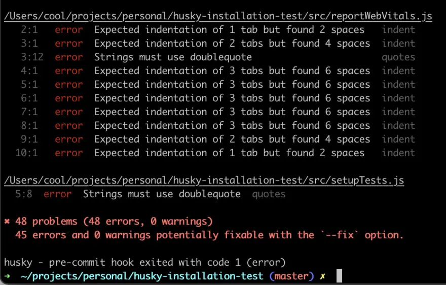

How do you make sure that ESLint rules configured in your project are followed by all your team members and code with issues are not pushed to remote Git repository?

Answer to the question is; using <a href="https://github.com/typicode/husky" target="_blank" rel="noopener">Husky package</a> with git hooks. <a href="https://www.atlassian.com/git/tutorials/git-hooks" target="_blank" rel="noopener">Git hooks</a> are one of the most popular way to trigger and enforce different side effects like ESLint rules. Husky depends on git hooks to trigger ESLint rules and make sure that all issues are resolved before you or anyone on your team can commit and push new changes to Git.

## Assumptions

- You have basic knowledge of ReactJS 
- You have worked with ESLint previously and have required configuration file for ESLint in your project

## What are Git Hooks?

Git hooks are a set of scripts that Git executes before or after events such as: commit, push, and receive. Git hooks are a built-in feature - you don't need to download anything for them to work.

When you initialize git in your project with `git init`, git hooks are also automatically added. You can find sample files for each event under the folder `your_project_path/.git/hooks`.

To view list of sample files for various types of hooks, you can hit the following command:

```cmd
  $ ls your_project_path/.git/hooks
```

At <a href="https://truemark.com.np" target="_blank" rel="noopener">Truemark</a>, we normally use it to enforce coding standards and code quality by running ESLint before "git commit".

## What is Husky?

One important thing to note for Git Hooks is, it is not version controlled, meaning whatever you add to hooks folder is only in your machine and not configured in the GIT. 

So, what happens when new member in your team clones the repository? 
Nothing, they will get sample files like I mentioned above.

What?

Then "How do we as a team make sure that hooks are executed for everyone?"

The answer to that is **husky** package.

Husky package helps you and your team to manage and configure Git hooks in your projects. 

With "husky" installed in your project; after you clone the repo, you just have to hit the command `npm run prepare` and all hooks are configured by husky in your machine.

Husky makes git hooks much more manageable because you don't have to write scripts for hooks manually. You can just add the command you want to run e.g. run ESLint before commit inside the configuration file provided by Husky and everything else will be taken care by the package.

## Install Husky

Execute the following in the command line:

```cmd
  npm install husky -D
```

This will add the husky package to your package.json under "devDependencies":

```json
  "devDependencies": {
    // other dependencies here,
    "husky": "^7.0.4"
  }
```

## Enable Git Hooks in your Project with Husky

You can enable git hooks in your project by running the command provided by husky package. In your project root path run following commands:

```cmd
  npm set-script prepare "husky install"
  npm run prepare
```

After running above commands, you should see the following inside package.json:

```json
  "scripts": {
    // other scripts here,
    "prepare": "husky install"
  }
```

This will also add required hooks in your project inside the folder `.git/hooks/`.

It will also add configuration files for Husky under the folder `.husky` inside your project root. This file is used to control all git hooks configured in your project, and this is also where you will be adding configurations for running ESLint before commit.

## Enable ESLint as Pre-Commit Hook with Husky

Update scripts under package.json and add the script to run ESLint:

```json
  "scripts": {
      // other scripts here,
      "lint": "eslint ."
    }
```

Add a pre-commit hook to run eslint with husky by running the following command:

```cmd
  npx husky add .husky/pre-commit "npm run lint"
```

You should see the following code inside `.husky/pre-commit` file now:

```sh
  #!/bin/sh
  . "$(dirname "$0")/_/husky.sh"

  npm run lint
```

## Run ESLint on git commit

After you are done making changes to your code, try committing your code:

```cmd
  git add .
  git commit -m "your commit message"
```

Git hooks will run ESLint before commit and throw errors if any. If it didn't throw any error, add new code with issues manually and see the hook in action 🙈

This is something similar to what you will see in case there are issues in your code:



If there are no errors then your code will be committed to git and you can push to the remote repository.

## What is lint-staged?

With Husky, ESLint is run on each and every file inside the project and if you ask me if that is a good idea; I will tell you that it's a very bad idea.
 
Why? Because running ESLint on code that was not changed as part of the feature can lead to various unforeseen bugs.
 
For big projects it can take a lot of time to run eslint on each and every file inside the project. Also in old projects, it doesn't make sense to sit and fix all best practice issues instead of shipping new features.

So, how do we run ESLint only on the code that we changed?

The answer is <a href="https://github.com/okonet/lint-staged" target="_blank" rel="noopener">lint-staged</a>. It is a package that helps in running pre-commit hooks only on files that have been changed in current commit.

## Install lint-staged

Run the following command to install lint-staged in the project:

```cmd
  npm install lint-staged --save-dev
```

You should see the following in your package.json:

```json
  "devDependencies": {
    // other dependencies here,
    "lint-staged": "^12.3.8",
  }
```

## Run ESLint on "git commit" with Husky and lint-staged

You can configure lint-staged in separate file or inside package.json itself, since there is only one command I felt that it was not worth it to have a separate file for the configuration.

You can view all supported options <a href="https://github.com/okonet/lint-staged#configuration" target="_blank" rel="noopener">here</a>.

Add following to package.json just below scripts:

```json
  "scripts": {
    "build": "react-scripts build",
    "eject": "react-scripts eject",
    // other scripts here,
  },
  "lint-staged": {
    "*.{js,jsx}": "eslint --fix"
  }
```

We have added {js,jsx} so that staged files with only these extension are run through lint. You can update this to support other extensions like ts, tsx for typescript.

Update pre-commit file to run lint-staged and remove other commands, your file should look like this:

```sh
  #!/bin/sh
  . "$(dirname "$0")/_/husky.sh"

  npx lint-staged
```

This will run lint-staged script which will show ESLint issues only on staged files.

To test, you can now manually add new code with issues and see issues thrown only on changed files instead of in all files inside the project as what had happened previously before configuring lint-staged.

## Conclusion

With Husky package configured in your project, you will never have to worry about having to comment on issues in merge requests which could already have been detected by ESLint in local machine of developers. This way, you and your team can focus on having meaningful discussion in merge requests which leads to overall growth of the project and members in your team.

Thanks for reading. Happy coding!

## Image Credits

- Cover Image by <a href="https://unsplash.com/@wolfart32?utm_source=unsplash&utm_medium=referral&utm_content=creditCopyText" target="_blank" rel="noopener">WOLF Λ R T</a> on <a href="https://unsplash.com/s/photos/husky?utm_source=unsplash&utm_medium=referral&utm_content=creditCopyText" target="_blank" rel="noopener">Unsplash</a>
  

## References

- <a href="https://githooks.com/" target="_blank" rel="noopener">Git Hooks</a>
- <a href="https://github.com/typicode/husky" target="_blank" rel="noopener">Husky - Official Documentation</a>
- <a href="https://github.com/okonet/lint-staged" target="_blank" rel="noopener">Lint Staged - Official Documentation</a>
