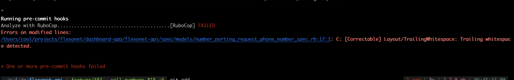
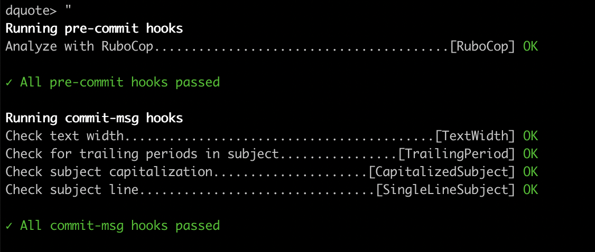

How do you make sure that RuboCop rules configured in your project are followed by all your team members and code with issues are not pushed to Git repository?

Answer is using <a href="https://github.com/sds/overcommit" target="_blank" rel="noopener">Overcommit gem</a> with git hooks. Git hooks are one of the most popular way to trigger and enforce different side effects like RuboCop rules. Overcommit gem depends on git hooks to trigger RuboCop rules and make sure that all issues are resolved before you or anyone on your team can commit and push new changes to Git.

## Assumptions

- You have basic knowledge of Rails 
- You have worked with RuboCop previously and have required configuration files for RuboCop in your project

_Shameless Plug_:

If you are new to RuboCop, you can read about it with setup instructions in my another article - <a href="https://prabinpoudel.com.np/articles/beginners-guide-to-rubocop-in-rails/" target="_blank" rel="noopener">Beginner's Guide to RuboCop in Rails</a>

## In this blog

You will be learning the following:

- What are git hooks?
- Why use git hooks?
- What is overcommit gem?
- Install overcommit gem
- Enable git hooks in your project with overcommit gem
- Enable RuboCop as pre-commit hook with overcommit gem
- Update git hooks with overcommit gem
- Run RuboCop on "git commit"

## What are Git Hooks?

Git hooks are a set of scripts that Git executes before or after events such as: commit, push, and receive. Git hooks are a built-in feature - you don't need to download anything for them to work.

When you initialize git in your project with `git init`, git hooks are also automatically added. You can find sample files for each event under the folder `your_project_path/.git/hooks`.

To view list of sample files for various types of hooks, you can hit the following command:

```cmd
  $ ls your_project_path/.git/hooks
```

## Why use Git Hooks?

There are various use cases for git hooks:

- Check the commit message for spelling errors
- Enforce pattern for commit messages
- Enforce project coding standards like RuboCop
- Email/SMS team members of a new commit
- Push the code to production

At <a href="https://truemark.com.np"  target="_blank" rel="noopener">Truemark</a>, we normally use it to enforce coding standards and code quality by running RuboCop before "git commit".

## What is Overcommit Gem?

One important thing to note for Git Hooks is it is not version controlled, meaning whatever you add to hooks folder is only in your machine. 

So, what happens when new member in your team clones the repository? 
Nothing, they will get sample files like I mentioned above.

What?

Then "How do we as a team make sure that hooks are executed for everyone?"

The answer to that is **overcommit** gem.

Overcommit gem helps you and your team to manage and configure Git hooks in your projects. 

With overcommit gem installed in your project; after you clone the repo, you just have to hit the command `overcommit --install` and all hooks are configured by overcommit in your machine.

Overcommit gem makes git hooks much more manageable because you don't have to write scripts for hooks manually. You can just add the command you want to run e.g. run RuboCop before commit, inside the configuration file provided by overcommit gem and everything else will be taken care by the gem.

## Install Overcommit Gem

Add the following to your Gemfile:

```rb
  group :development, :test do
    # run rubocop before commit with overcommit and much more
    gem 'overcommit', '~> 0.58.0'
  end
```

## Enable Git Hooks in your Project with Overcommit Gem

You can enable git hooks in your project by running the command provided by overcommit gem. From your project root path:

```cmd
  overcommit --install
```

This will add required hooks in your project inside the folder `.git/hooks/`

It will also add configuration file `.overcommit.yml` inside your project root. This file is used to control all git hooks configured in your project, and this is also where you will be adding configurations for running rubocop before commit.

## Enable RuboCop as Pre-Commit Hook with Overcommit

You can remove everything inside the configuration file `.overcommit.yml` and add the following inside:

```yml
# Use this file to configure the Overcommit hooks you wish to use. This will
# extend the default configuration defined in:
# https://github.com/sds/overcommit/blob/master/config/default.yml
#
# At the topmost level of this YAML file is a key representing type of hook
# being run (e.g. pre-commit, commit-msg, etc.). Within each type you can
# customize each hook, such as whether to only run it on certain files (via
# `include`), whether to only display output if it fails (via `quiet`), etc.
#
# For a complete list of hooks, see:
# https://github.com/sds/overcommit/tree/master/lib/overcommit/hook
#
# For a complete list of options that you can use to customize hooks, see:
# https://github.com/sds/overcommit#configuration
#
# Uncomment the following lines to make the configuration take effect.

PreCommit:
 RuboCop:
   enabled: true
   on_warn: fail # Treat all warnings as failures
   problem_on_unmodified_line: ignore # run RuboCop only on modified code

```

What's with all these configuration options?

1. "PreCommit"
     
    Git hooks will run "rubocop" to check issues in code when you try to commit your changes.

2. `on_warn: fail` 

    All warnings will be treated as failures and you will have to resolve those warnings first before your code is committed to the remote git repository.

3. `problem_on_unmodified_line: ignore`

    Tell overcommit to run RuboCop only on code that were changed in this commit.
    
    This is specially useful when you are adding overcommit in old projects and you don't want to sit fixing all the issues inside the project. This lets you fix issues that you introduced or issues you want to refactor/fix while you can fix old issues in your own time (ohh, will that time ever come?).

## Update Git Hooks with Overcommit

Now that you have added configurations for running RuboCop on pre-commit, you will need to tell overcommit gem to persist these changes to "pre-commit" script inside git hooks folder.

1. Add changes inside overcommit.yml to git

    ```cmd
      git add .
    ```

2. Update scripts inside git hooks folder with overcommit gem

     ```cmd
       overcommit --sign
     ```

## Run RuboCop on git commit

After you are done making changes to your code and done with the part of "git add", try committing your code:

```cmd
  git commit -m "your commit message"
```

Git hooks will run RuboCop before commit and throw errors if any. If it didn't throw any error, add new code with issues manually and see the hook in action 🙈

This is something similar to what you will see in case there are issues in your code:



If there are no errors then your code will be committed to git and you can push to the remote repository.



## Conclusion

With overcommit gem configured in your project, you will never have to worry about having to comment on issues in merge requests which could already have been detected by RuboCop in local machine of developers. This way, you and your team can focus on having meaningful discussion in the merge requests which leads to overall growth of the project and members in your team.

If you use any other gem for managing git hooks, I would like to hear your opinions on what you think about the gem you are using in comparison to overcommit. Personally, I find overcommit gem much easier to use and with a lot of configuration options. (Oh boy! You haven't even tried other gems)

Happy coding!

## Image Credits

- Cover Image by <a href="https://unsplash.com/@kellysikkema?utm_source=unsplash&utm_medium=referral&utm_content=creditCopyText" target="_blank" rel="noopener">Kelly Sikkema</a> on <a href="https://unsplash.com/s/photos/commitment?utm_source=unsplash&utm_medium=referral&utm_content=creditCopyText" target="_blank" rel="noopener">Unsplash</a>

## References

- <a href="https://githooks.com/"  target="_blank" rel="noopener">Git Hooks</a>
- <a href="https://github.com/sds/overcommit"  target="_blank" rel="noopener">Overcommit Gem - Official Documentation</a>
