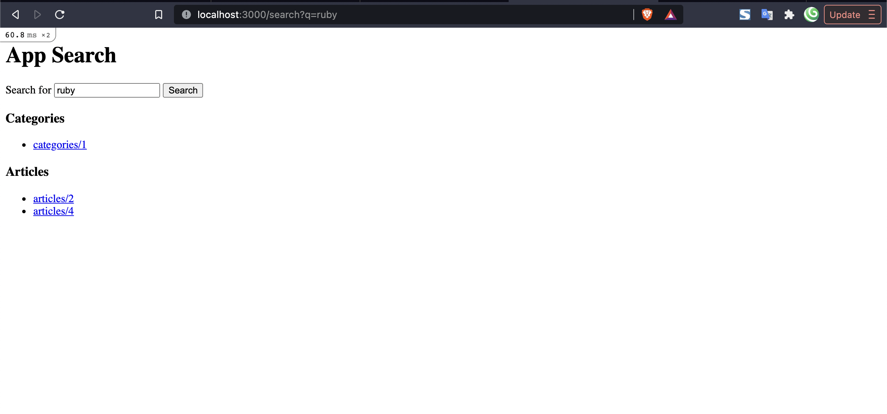

I had always wondered "How do I search through the relational database, in any table, in any column and get the related result?". After searching for a bit, I reached to the conclusion **YOU DON'T**.

Searching through more than one table and add to that, more than one column is very complex with relational database. That's where Elasticsearch comes into play. Elasticsearch stores all records in documents and provides search functionality that is very fast.

__DISCLAIMER__

Before we move into the implementation part of the tutorial, I want to make this clear:

> This is not the tutorial for building the web search engine like Google. What you will be building is a search engine for the Rails App where you can search for any string inside any table in the app. This will help you in adding the functionality of app wide search.

Now then, let's create a search engine for our Rails App.

## Clone the example Rails app

I have prepared an example app for making it more easier to follow through the tutorial and pushed to Github. You can clone it from <a href="https://flaviocopes.com/redis-installation/"  target="_blank" rel="noopener">here</a>.

Or with the following command:

```cmd
  git clone git@github.com:coolprobn/rails-search-engine.git
```

## Configure Elasticsearch

### Install Elasticsearch

You can install Elasticsearch by following instructions in the <a href="https://www.elastic.co/guide/en/elasticsearch/reference/current/install-elasticsearch.html" target="_blank" rel="noopener">official website</a>.

### Run Elasticsearch Server

When you have installed Elasticsearch in your machine, you will also be presented with commands to run the server. You can also find commands to run Elasticsearch for your OS <a href="https://www.elastic.co/guide/en/elasticsearch/reference/current/starting-elasticsearch.html" target="_blank" rel="noopener">here</a>.

Following command is for MacOS where I installed Elasticsearch with Homebrew:

1. Run only once

	`elasticsearch`

2. Run in background and on machine restart

	`brew services start elastic/tap/elasticsearch-full`

_NOTE_: It can take some time to fully start the server.

### Check if Elasticsearch is working

You can check if Elasticsearch is working by opening localhost on port **9200** in your browser:

`http://localhost:9200/`

You should see content similar to this:

```
{
  "name" : "Prabins-MacBook-Pro.local",
  "cluster_name" : "elasticsearch_cool",
  "cluster_uuid" : "J2CAnnSoRI6p2zZGV3K8eg",
  "version" : {
    "number" : "7.13.3",
    "build_flavor" : "default",
    "build_type" : "tar",
    "build_hash" : "5d21bea28db1e89ecc1f66311ebdec9dc3aa7d64",
    "build_date" : "2021-07-02T12:06:10.804015202Z",
    "build_snapshot" : false,
    "lucene_version" : "8.8.2",
    "minimum_wire_compatibility_version" : "6.8.0",
    "minimum_index_compatibility_version" : "6.0.0-beta1"
  },
  "tagline" : "You Know, for Search"
}
```

## Install elasticsearch in the app

Add the following to your `Gemfile.rb`

```ruby
# Elasticsearch for powerful searching
gem 'elasticsearch-model'
gem 'elasticsearch-rails'
```

Install gems with `bundle install`

## Add Elasticsearch to Models

Add following to all the models. At present, there are three models inside the app; Author, Article and Category.

Example for Author model:

```ruby
class Author < ApplicationRecord
  include Elasticsearch::Model
  include Elasticsearch::Model::Callbacks
end
```

This will allow the models in the app to be searched through elasticsearch.

## Create Searchable module

Hmm, that was cumbersome 😪. You can refactor and DRY the code by creating a concern called **Searchable** and just include that module in all models. This module can also have other configurations required to make the search more powerful.

Create the concern inside `app/models/concerns/searchable.rb` and add the following

```ruby
module Searchable
  extend ActiveSupport::Concern

  included do
    include Elasticsearch::Model
    include Elasticsearch::Model::Callbacks
  end
end
```

### Include Searchable module in required models

Now, you can include the **Searchable** module in the models, at the moment there are there are three models in the app: Author, Article and Category, you can include the module as required in each one of them.

Example for Author model:

```ruby
# app/models/author.rb
class Author < ApplicationRecord
  include Searchable

  # remaining code
end
```

Now all the codes inside Searchable module will be accessible to models where this module is configured or included.

## Index database records of required models/tables

To make all records inside the database available to the Elasticsearch they need to be indexed/stored in various documents first. When comparing to relational database, indexing is same like storing records in tables.

### Create a rake task to automate the indexing process

Create a file `lib/tasks/elastic_search.rake` and add the following:

```ruby
namespace :elastic_search do
  desc 'Index models to elasticsearch'
  task :index_models, [:models] => :environment do |_, args|
    # eager load first so that models are available for next step
    Rails.application.eager_load!
    
    # include all models inside the app/models folder
    default_models = ApplicationRecord.descendants.map(&:to_s)

    argument_models = args[:models]&.split(',')&.map(&:strip)
    models = argument_models || default_models

    model_classes = models.map { |model| model.underscore.camelize.constantize }

    model_classes.each do |model|
      model.import force: true
    end
  end
end
```

Inside the rake task, following thing is happening:

1. `[:models]` allows the rake task to accept arguments, in this case rake task accepts string separated by "," i.e. each model name which needs to be indexed is separated by a comma.
2. `Rails.application.eager_load!` loads all the classes inside the "app" folder, this is so that all model names are available to this rake task in the next step.
3. `ApplicationRecord.descendants.map(&:to_s)` returns array of model names inside the folder `app/models` meaning all models in the app will be indexed. If this is not what you desire you can replace the code with array of model name like `['Author', 'Article']`
4. If argument is passed which should be in the form of string separated by comma as mentioned above, they are converted to array by using the `split` method and then unnecessary whitespace are removed with `strip` method
5. In `model_classes`, each model name is converted to camel case to maintain consistency and avoid errors, and then each model name which is in string is converted to **constant** with the help of the method `constantize`.
6. Finally, each model is looped through and indexed one by one with the method 'import' provided by elasticsearch gem.

### Index models

1. Index all models
    
    If you are running the rake task for the first time, it's better if you don't pass any argument since you want records from all models to be indexed.

    Run the following command in that case:

    `rails elastic_search:index_models`

2. For new models
   
    If you add new models, you will normally want to only index that model, for that you can pass the names of new models when executing the rake task

    `rails "elastic_search:index_models[Comment\, Tag]"`

    You need to escape comma (,) with `\` otherwise it will be treated as second argument to rake task and only "Comment" will be passed to the argument model_names.

## Search with Elasticsearch

Now that all the records from required models are indexed, it's finally the time to search through them.

### Search only one model

You can search only one model with `ModelName.search 'query'`. Go to rails console and fire the command:

`Author.search 'Jane'`

```cmd
> response = Author.search('Jane').results
> response.first.as_json
=> {"_index"=>"authors", "_type"=>"_doc", "_id"=>"2", "_score"=>0.6931471, "_source"=>{"id"=>2, "first_name"=>"Jane", "last_name"=>"Jones", "email"=>"jane@email.com", "nickname"=>"marvellous.jane", "created_at"=>"2021-07-25T15:18:18.192Z", "updated_at"=>"2021-07-25T15:18:18.192Z"}}
```

For the result part, you can also achieve the similar result by using the method "records" instead of "results". Difference between them is, "results" always returns Elasticsearch result while "records" convert Elasticsearch results to active record query.

You can read more about **records** <a href="https://github.com/elastic/elasticsearch-rails/tree/master/elasticsearch-model#search-results-as-database-records"  target="_blank" rel="noopener">here</a>

### Search in multiple models

You can search in multiple models with `Elasticsearch::Model.search('query', [ModelName1, ModelName2])` e.g. `Elasticsearch::Model.search('ruby', [Article, Category])`

```cmd
> Elasticsearch::Model.search('Ruby', [Article, Category]).results.as_json
	
=> [{"_index"=>"categories", "_type"=>"_doc", "_id"=>"1", "_score"=>1.5697745, "_source"=>{"id"=>1, "title"=>"ruby", "created_at"=>"2021-07-25T15:18:18.202Z", "updated_at"=>"2021-07-25T15:18:18.202Z"}}, {"_index"=>"articles", "_type"=>"_doc", "_id"=>"2", "_score"=>1.2920684, "_source"=>{"id"=>2, "title"=>"Build Twitter Bot with Ruby", "content"=>"Today, we will be building a bot for Twitter that will retweet all hashtags related to #ruby or #rails. We can also configure it to retweet any hashtags so you can use this tutorial to create bot that can retweet whatever hashtag you want. Yes, and we will be building this Twitter bot with Ruby.\n\nWe will be using Twitter gem (Github) to help us in getting up and running quickly with Twitter APIs.\n", "published_on"=>"2021-04-23T05:00:00.000Z", "author_id"=>1, "created_at"=>"2021-07-25T15:18:18.236Z", "updated_at"=>"2021-07-25T15:18:18.236Z"}}, {"_index"=>"articles", "_type"=>"_doc", "_id"=>"4", "_score"=>0.83619946, "_source"=>{"id"=>4, "title"=>"Setup Factory Bot in Rails", "content"=>"Factory Bot is a library for setting up test data objects in Ruby. Today we will be setting up Factory Bot in Rails which uses RSpec for testing. If you are using different test suite, you can view all supported configurations in the official github repository of Factory Bot.\n", "published_on"=>"2021-06-13T13:00:00.000Z", "author_id"=>2, "created_at"=>"2021-07-25T15:18:18.245Z", "updated_at"=>"2021-07-25T15:18:18.245Z"}}]
```

## Converting Search Results to Active Record

You can convert search result to active record with `to_a` For e.g. `Author.search('john').records.to_a`

```cmd
> Author.search('john').records.to_a
Author Load (0.4ms)  SELECT "authors".* FROM "authors" WHERE "authors"."id" = $1  [["id", 1]]
=> [#<Author id: 1, first_name: "John", last_name: "Doe", email: "john@email.com", nickname: "john101", created_at: "2021-07-25 15:18:18.190094000 +0000", updated_at: "2021-07-25 15:18:18.190094000 +0000">]
```

This tutorial won't use this technique nor should this be used in actual implementation because it executes an extra query and adds more time to the request since each record should be converted to Active Record. In production application and especially for search app even 1 millisecond matters which is why in this tutorial, all search results will be converted to JSON and same records will be rendered inside the "view".

## API for search engine

Adding the search functionality to the app means everything that happened above in rails console should be replicated and added to the API.

### Create a controller

From command line, run the command to create the controller: `touch app/controllers/search_controller.rb`

Add the following to it:

```
class SearchController < ApplicationController
  def search
    if params[:q].blank?
      @results = []
    else
      @results = Elasticsearch::Model
                   .search(params[:q])
                   .results.as_json
                   .group_by { |result| result['_index'] }
    end
  end
end
```

Results are grouped by "_index" so that results can be separated for each model name when rendering in the view.

### Add a route

Add the following to `config/routes.rb`

`get :search, to: 'search#search'`

## View to search and show results
   
To provide the search capability to the users, you will need to have:

1. Search box where user can input their search query
2. Show list of results for the search

Create a view

```cmd
  $ mkdir app/views/search
  $ touch app/views/search/search.html.erb
```

Add the following inside:

```ruby
<h1>App Search</h1>

<%= form_for search_path, method: :get do |f| %>
  <p>
    <%= f.label "Search for" %>
    <%= text_field_tag :q, params[:q] %>
    <%= submit_tag "Search", name: nil %>
  </p>
<% end %>

<% if params[:q] && @results.blank? %>
  <p>No results found for <%= params[:q] %></p>
<% end %>

<% @results.each do |group, records| %>
  <h3><%= group.titleize %></h3>

  <ul>
    <% records.each do |record| %>
      <% record_link = "#{group}/#{record['_id']}" %>

      <li>
        <%= link_to record_link, record_link %>
      </li>
    <% end %>
  </ul>
<% end %>
```

## Test the implementation

Fire up the rails server `rails s` and go to `localhost:3000/search`, you will see a view with search box in it like this:


Type relevant text e.g. "ruby" and hit search.

Tada 🎉 

You will see search results grouped by model name and link to individual record's detail page like this:




If there are no results you will see "No results found for [query]" like this:


Since there aren't any APIs and required Views for other features, link will not work at the moment.

## Highlight matched text

Elasticsearch also provides the feature of highlighting the matched text like what Google does in it's search results. You can take the search feature to next level by adding the highlighted text and rendering them in the view.

### Update search query in the controller

Update the code inside else part of the controller in "search" action with the following:

```ruby
@results = Elasticsearch::Model
                   .search(params[:q], [], { body: highlighted_fields })
                   .results.as_json
                   .group_by { |result| result['_index'] }
```

### Add private method for highlight fields

```ruby
private

def highlight_fields
  {
    highlight: {
      fields: {
        pre_tags: ['<strong>'],
        post_tags: ['</strong>'],
        first_name: {},
        last_name: {},
        nickname: {},
        email: {},
        title: {},
        content: {}
      }
    }
  }
end
```

Inside "fields" in the method "highlight_fields", you can add column names of any model that you want to highlight the text of. Current configuration includes highlighting for all 3 models available in the app.

By default, highlighted texts are wrapped around "em" tag and can easily be overridden by specifying `pre` and `post` tags; here "em" tag is overridden by "strong" tag because I felt that bold text catches more attention than italicized text. You can ignore these two tags and remove them completely if you think italicized texts work great.

Your final controller will look like this:

```ruby
class SearchController < ApplicationController
  def search
    if params[:q].blank?
      @results = []
    else
      @results = Elasticsearch::Model
                   .search(params[:q], [], { body: highlight_fields })
                   .results.as_json
                   .group_by { |result| result['_index'] }
    end
  end

  private

  def highlight_fields
    {
      highlight: {
        fields: {
          pre_tags: ['<strong>'],
          post_tags: ['</strong>'],
          first_name: {},
          last_name: {},
          nickname: {},
          email: {},
          title: {},
          content: {}
        }
      }
    }
  end
end

```

### Update view to show highlighted text

Add following code just below the "link_to":

```erb
<% record['highlight']&.each do |key, snippet| %>
  <p><%= "#{key} - " %> <%= sanitize(snippet[0]) %></p>
<% end %>
```

Highlighted result will be available inside the key "highlight" and text to highlight will be available inside the "snippet" key which is what we are using to render highlighted text.

Your final view will look like this:

```
<h1>App Search</h1>

<%= form_for search_path, method: :get do |f| %>
  <p>
    <%= f.label "Search for" %>
    <%= text_field_tag :q, params[:q] %>
    <%= submit_tag "Search", name: nil %>
  </p>
<% end %>

<% if params[:q] && @results.blank? %>
  <p>No results found for <%= params[:q] %></p>
<% end %>

<% @results.each do |group, records| %>
  <h3><%= group.titleize %></h3>

  <ul>
    <% records.each do |record| %>
      <% record_link = "api/v1/#{group}/#{record['_id']}" %>

      <li>
        <%= link_to record_link, record_link %>

        <% record['highlight']&.each do |key, snippet| %>
          <p><%= "#{key} - " %> <%= sanitize(snippet[0]) %></p>
        <% end %>
      </li>
    <% end %>
  </ul>
<% end %>
```

You can search again for the same query and you will see the highlighted text like this:


## Improve the app further

There are many functionalities that I have skipped deliberately for making this tutorial small and more simpler, you can add the following functionalities if you want to play more with this app:

1. Add API and required view to make the links to detail page work
2. Show related articles when associated author or category is searched, for e.g. if user searches for "jane" show articles of the author "Jane", or for "ruby" show all articles that have categories "Ruby"

## Conclusion

In real world application, I am sure that search functionality can be a lot complex than what is shown here, but this is the start and you can build as required on top of this.

I had always wanted to explore the idea of app wide search, and this blog is the result of my habit of exploring new technology every Sunday. It was fun to learn about elasticsearch, research through the internet on how other have implemented similar search features and actually implementing this with the sample app and in existing project for the client.

I hope you enjoyed this blog as much as I enjoyed it building and writing. I thank you for sticking with me to the very end of the blog.

Full code of this tutorial is available in the branch "app-search", you can find it <a href="https://github.com/coolprobn/rails-search-engine/pull/1" target="_blank" rel="noopener">here</a>.

Happy tinkering and happy coding!

## Image Credits

- Cover Image by <a href="https://unsplash.com/@jontyson?utm_source=unsplash&utm_medium=referral&utm_content=creditCopyText" target="_blank" rel="noopener">Jon Tyson</a> on <a href="https://unsplash.com/s/photos/search-engine?utm_source=unsplash&utm_medium=referral&utm_content=creditCopyText" target="_blank" rel="noopener">Unsplash</a>