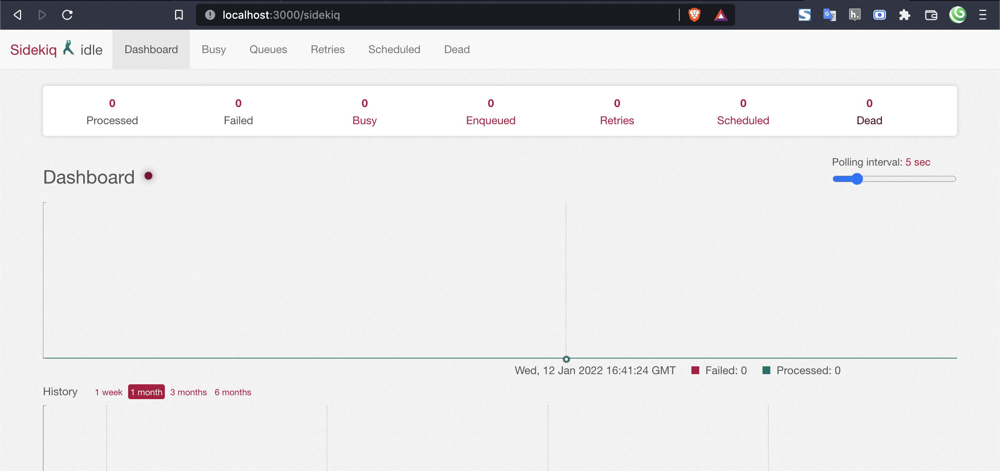

Active Job is a framework for declaring jobs and making them run on a variety of queuing backends. These jobs can be everything from regularly scheduled clean-ups, to billing charges, to mailings. Anything that can be chopped up into small units of work and run in parallel.

Active Job comes pre installed in Rails.

Now on to Sidekiq; it is one of the most widely used background job frameworks that you can implement in a Rails application. It is multi-threaded and utilizes Redis for its queuing storage.

Today we will be working on setting up Active Job with Sidekiq while also following the official Rails documentation.

## Skills required to follow the tutorial

Intermediate:

- Rails
- Linux skills to work with commands in server where your app has been deployed

## You should have

- Existing Rails app
- Linux server already setup to run Rails app

## Step 1: Install Capistrano Gems

Add the following to your Gemfile under development group:

```ruby
gem 'sidekiq'
```

Run the following in command line:

```shell
$ bundle install
```

That should install the latest version of Sidekiq gem, now let's lock the version by looking at the "Gemfile.lock", this version was what I had in my lock file, yours could be different.

```ruby
gem 'sidekiq', '~> 7.0.0'
```

## Step 2: Enable Sidekiq

Add the following to "config/application.rb"

```ruby
# Use sidekiq for active jobs
config.active_job.queue_adapter = :sidekiq
```

## Step 3: Install Redis

Redis is an open source, in-memory data store used by millions of developers as a database, cache, streaming engine, and message broker. It is an in-memory key-value store known for its flexibility and performance.

Sidekiq is backed by Redis as a job management store to process thousands of jobs per second.

<a href="https://redis.io/docs/getting-started/installation/" target="_blank" rel="noopener">Official Redis Documentation</a> has got you covered for the installation of Redis in any OS.

### On MacOS via Homebrew

If you are on MacOS, you can follow instructions at <a href="https://redis.io/docs/getting-started/installation/install-redis-on-mac-os/" target="_blank" rel="noopener">Install Redis on MacOS (Official Documentation)</a>.

### Linux

You can either choose to install from <a href="https://redis.io/docs/getting-started/installation/install-redis-from-source/" target="_blank" rel="noopener">source</a> or from <a href="https://redis.io/docs/getting-started/installation/install-redis-on-linux/" target="_blank" rel="noopener">APT repository</a>. 

I had installed Redis from the source and these were the instructions that I needed to perform from the command line:

```shell
$ wget http://download.redis.io/redis-stable.tar.gz
$ tar xvzf redis-stable.tar.gz
$ cd redis-stable
$ make
```

Copy the executables to you local usr bin folder so you can run the redis-server and cli commands from your home/user directory

```shell
sudo cp src/redis-server /usr/local/bin/
sudo cp src/redis-cli /usr/local/bin/
```

#### Automatically start on machine restart

_NOTE:_ You can also find these instructions in the official Redis documentation at <a href="https://redis.io/docs/getting-started/" target="_blank" rel="noopener">Getting Started > Installing Redis more properly</a>

1. Create a directory in which to store your Redis config files and your data:

    ```shell
    sudo mkdir /etc/redis
    sudo mkdir /var/redis
    ```

2. Copy the init script that you'll find in the Redis distribution under the utils directory into /etc/init.d. We suggest calling it with the name of the port where you are running this instance of Redis. For example:

    ```shell
    sudo cp redis-stable/utils/redis_init_script /etc/init.d/redis_6379
    ```

3. Edit the init script

    ```shell
    sudo nano /etc/init.d/redis_6379
    ```

    Make sure to modify REDISPORT according to the port you are using. Both the pid file path and the configuration file name depend on the port number. I had used the port "6379"

4. Copy the template configuration file you'll find in the root directory of the Redis distribution into /etc/redis/ using the port number as name, for instance:

    ```shell
    sudo cp redis-stable/redis.conf /etc/redis/6379.conf
    ```

5. Create a directory inside /var/redis that will work as data and working directory for this Redis instance:

  ```shell
  sudo mkdir /var/redis/6379
  ```

6. Edit the configuration file with `sudo nano /etc/redis/6379.conf`, making sure to perform the following changes:

    - Change the port accordingly. In our example it is not needed as the default port is already 6379. It is under the section ## NETWORK ##
    - Set daemonize to yes (by default it is set to no). It is under the section ## GENERAL ##.
    - Set the pidfile to /var/run/redis_6379.pid (modify the port if needed). It is under the section ## GENERAL ##
    - Set your preferred loglevel (notice by default). It is under the section ## GENERAL ##
    - Set the logfile to /var/log/redis_6379.log ("" by default). It is under the section ## GENERAL ##
    - Set the dir to /var/redis/6379 (very important step!). It is under the section ## SNAPSHOTTING ##

7. Finally add the new Redis init script to all the default runlevels using the following command

  ```shell
  sudo update-rc.d redis_6379 defaults
  ```

8. You are done! Now you can try running your instance with:

  ```shell
  sudo /etc/init.d/redis_6379 start
  ```

9. Test if it working correctly

  - Try pinging your instance with redis-cli using the command `redis-cli ping`, you should see PONG
  - Do a test save with `redis-cli save` and check that the dump file is correctly stored into /var/redis/6379/ (you should find a file called dump.rdb).
  - Check that your Redis instance is correctly logging in the log file with `tail -f /var/log/redis_6379.log`, you can exit with `CTRL + c`
  - If you are on a new machine/server where you can try things without taking anything else down in the machine/server make sure that after a reboot everything is still working (redis should start automatically on machine restart)

### Windows

If you are on Windows, you can follow instructions at <a href="https://redis.io/docs/getting-started/installation/install-redis-on-windows/" target="_blank" rel="noopener">Install Redis on Windows (Official Documentation)</a>.

## Step 4: Enable Web UI to Monitor Jobs

Add the following to your "config/routes.rb":

```ruby
# config/routes.rb

require 'sidekiq/web'

Myapp::Application.routes.draw do
  # mount Sidekiq::Web in your Rails app
  mount Sidekiq::Web => "/sidekiq"
end
```

## Step 6: Accessing the Sidekiq Web UI

1. Run rails server: `rails s`
2. Go to "http://localhost:3000/sidekiq"

You should now see the UI similar to this:



## Step 6: Add Basic Authentication to Web UI for Preventing Unauthorized Access

By default there is no authentication and anyone that knows your API URL will be able to access the sidekiq UI.

You can allow any authenticated `User` to access the Sidekiq UI by adding following configurations to your "config/routes.rb":

```ruby
# config/routes.rb

authenticate :user do
  mount Sidekiq::Web => '/sidekiq'
end
```

_NOTE:_ This configuration is for the <a href="https://github.com/heartcombo/devise" target="_blank" rel="noopener">Devise gem</a>, if you are using any other authentication gem then this configuration might be different.

You can view more options for authenticating users to restrict Sidekiq UI at <a href="https://github.com/mperham/sidekiq/wiki/Monitoring#authentication" target="_blank" rel="noopener">Authentication (Sidekiq Gem Github)</a>.

## Example Job

Now let's look at how a job can look like in the Rails App after setting up Sidekiq.

### Application Job

Your "app/jobs/application.job" should look similar to the following:

```ruby
class ApplicationJob < ActiveJob::Base
  queue_as :default
  # Automatically retry jobs that encountered a deadlock
  # retry_on ActiveRecord::Deadlocked

  # Most jobs are safe to ignore if the underlying records are no longer available
  # discard_on ActiveJob::DeserializationError
end
```

Only change from the default ApplicationJob that Rails generates by default is that we have added `queue_as :default` so we don't have to add it in all other jobs we add in our app.

If you want your job to be queued with the highest priority then in the new job you generate, you should update `queue_as` to high e.g. `queue_as :high` to override the `queue_as :default` inside the Application Job.

### Expire User Note Job

Let's say you have a job that automatically removes the status of the user after certain time e.g. in the communication app called <a href="https://slack.com/" target="_blank" rel="noopener">Slack</a> we can add status and set expiration date and time. Your job could like the following for such feature:

```ruby
class ExpireUserStatusJob < ApplicationJob
  def perform(user_status_id)
    status = UserStatus.find(user_status_id)

    return if status.blank? || !status.expired?

    status.update!(description: nil, expiry_date: nil, expiry_time: nil)
  end
end
```

And you could queue the job from UserStatus model by triggering the method "schedule_expiration" from the controller whenever the user status is updated:

```ruby
class UserStatus < ApplicationRecord
  validates :expiry_date, presence: true, if: -> { expiry_time }
  validates :expiry_time, presence: true, if: -> { expiry_date }
  validates :description, presence: true, if: -> { expiry_date || expiry_time }

  def schedule_expiration
    return if expiry_date.blank? || expired?

    expiry_date_time = combine_date_time(expiry_date, expiry_time)

    ExpireUserStatusJob.set(wait_until: expiry_date_time).perform_later(id)
  end

  private

  def expired?
    return if expiry_date.blank? || expiry_date < Time.zone.today

    expiry_time.blank? || expiry_time.to_s(:time) <= Time.zone.now.to_s(:time)
  end

  def combine_date_time(date, time)
    DateTime.new(date.year, date.month, date.day, time.hour, time.min, time.sec)
  end
end
```

## Bonus: Setup Sidekiq in Ubuntu Server

### Setup

1. Create a file called sidekiq.service `sudo nano /lib/systemd/system/sidekiq.service`
2. Copy content from <a href="https://github.com/mperham/sidekiq/blob/main/examples/systemd/sidekiq.service" target="_blank" rel="noopener">Example Sidekiq systemd configurations</a> to this file.
3. Update the file:
  - Change the WorkingDirectory to the folder where your app is deployed e.g. `WorkingDirectory=/home/deploy/my-app/current`
  - Update the ExecStart path. This specifies the path and command to start Sidekiq. E.g. my current ExecStart path with rbenv is: `ExecStart=/home/deploy/.rbenv/shims/bundle exec sidekiq -e production`. 

  **_NOTE:_** If you are using different Ruby version manager then "/home/deploy/.rbenv/shims/bundle" will be different.

  - Add `ExecReload=/usr/bin/kill -TSTP $MAINPID` below `ExecStart=....`
  - Remove comment from `# User=deploy` and update deploy to be the user you are using in the server, mine was deploy so I changed the line to `User=deploy`
  - Uncomment `# Group=sudo` to make it `Group=sudo`
  - Uncomment `# UMask=0002` to make it `UMask=0002`
  - Update `WantedBy=multi-user.target` to `WantedBy=default.target`
  - Save the file

### Run Sidekiq

You can enable the Sidekiq service with `sudo systemctl daemon-reload`

You can start the Sidekiq service with `sudo systemctl start sidekiq`

Here are some useful commands for changing status of Sidekiq:

"sudo systemctl {start,stop,status,restart} sidekiq" e.g. `sudo systemctl status sidekiq`

You can also use "sudo service sidekiq {start,stop,status,restart}" to perform commands e.g. `sudo service sidekiq status`

### Sidekiq with Capistrano

If you are using capistrano for deployment, you can refer to the section "Bonus 2: Sidekiq for background jobs" to configure Sidekiq with Capistrano at <a href="/articles/deploy-api-only-rails-app-with-capistrano/#bonus-2-sidekiq-for-background-jobs" target="_blank">Deploy API only Rails App with Capistrano</a>.

## Conclusion

Congratulation!!! You have successfully setup and deployed sidekiq if you followed the blog all the way to the end.

If you have any queries or confusions please let me know in the comments below and I will help you to clear those to the best of my ability.

Thanks for reading. Happy tinkering and happy coding!

## Image Credits

- Cover Image by <a href="https://unsplash.com/@sunburned_surveyor?utm_source=unsplash&utm_medium=referral&utm_content=creditCopyText" target="_blank" rel="noopener">Scott Blake</a> on <a href="https://unsplash.com/s/photos/worker?utm_source=unsplash&utm_medium=referral&utm_content=creditCopyText" target="_blank" rel="noopener">Unsplash</a>

## References

- <a href="https://guides.rubyonrails.org/active_job_basics.html#setting-the-backend" target="_blank" rel="noopener">Active Job Basics [Rails Documentation]</a>
- <a href="https://www.digitalocean.com/community/tutorials/how-to-add-sidekiq-and-redis-to-a-ruby-on-rails-application" target="_blank" rel="noopener">How To Add Sidekiq and Redis to a Ruby on Rails Application [Digital Ocean]</a> 
