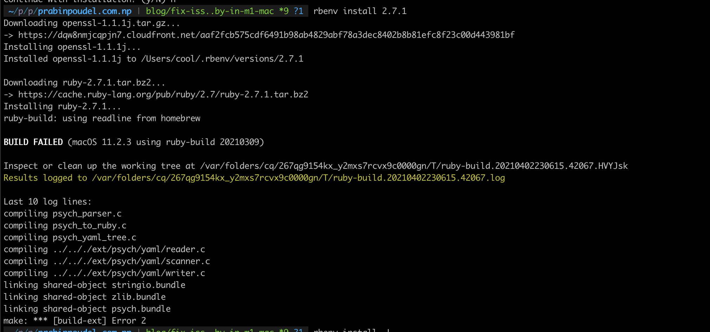

## Error Message

Let's reproduce the error first:

1. Install ruby with rbenv

    ```cmd
      $ rbenv install 2.7.2
    ```

    _NOTE_: In my M1 Mac, I tried installing various ruby versions with rbenv like 2.5.0, 2.6.0, 2.7.0, 2.7.1, 2.7.2  and always ran into this same issue.

2. Install error

    You will get the following error message 

      - BUILD FAILED (macOS 11.2.3 using ruby-build 20210309)
      - Inspect or clean up the working tree at `/var/folders/.....`

      <figure>
        <div class="browser-frame">
          
        </div>
        <figcaption><p>Error Message</p></figcaption>
      </figure>

## Fix

Instead of running the normal ruby install command with rbenv, let's prepend it with `RUBY_CFLAGS="-Wno-error=implicit-function-declaration"`, which will supress all error and warnings and let the ruby installation complete.

```cmd
$ RUBY_CFLAGS="-Wno-error=implicit-function-declaration" rbenv install 2.5.0
```

## Conclusion

Tada! See the magic? Ruby should install without any issue now.

Are you using any another method to fix the issue? Let us know in the comments below. 

Thank you for reading!

**References**

- <a href="https://github.com/rbenv/ruby-build/issues/1691#issuecomment-753636901" target="_blank">[Github] Installation issues with Arm Mac (M1 Chip)</a>

**Image Credits:** 

Cover Image by <a href="https://unsplash.com/@joshuafuller?utm_source=unsplash&utm_medium=referral&utm_content=creditCopyText" target="_blank">Joshua Fuller</a> from <a href="https://unsplash.com/s/photos/ruby?utm_source=unsplash&utm_medium=referral&utm_content=creditCopyText" target="_blank">Unsplash</a>
